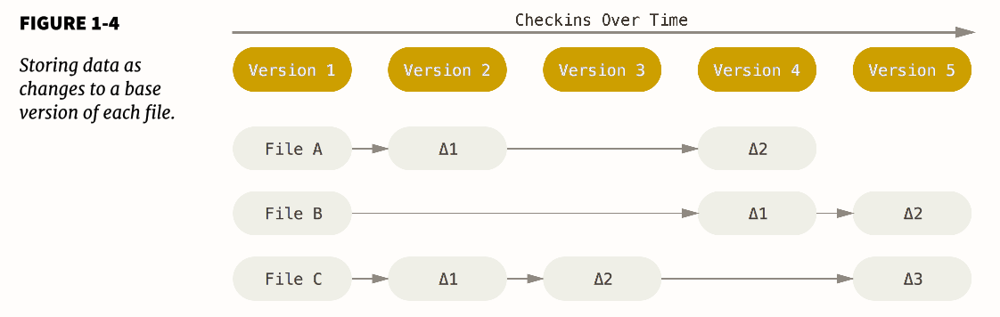
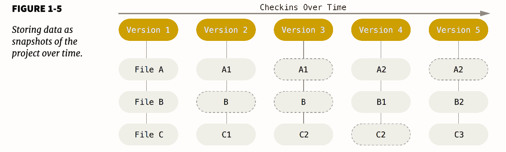
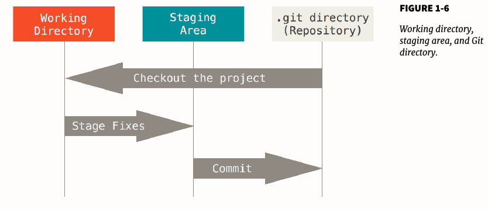
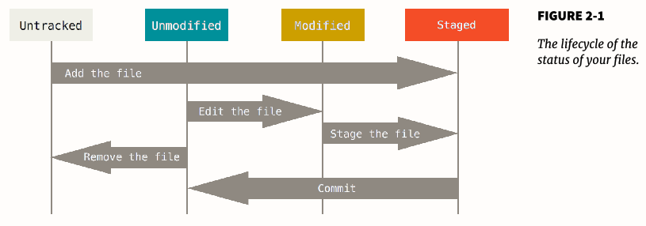

参考资料《Pro Git》

### 版本控制系统（vcs）发展

- **local version control system**，典型命令为mac上至今还有的RCS工具
- **centralized version control system**，a single server contains all the versioned files, may cause single point of failure
- **distributed version control system**,  典型代表：git, Mercurial, Bazaar, Darcs. Client fully mirror the repository.

#### git 发展

2005年，linux kernel的社区团队与商业公司BitKeeper公司的合作结束后开发。

Some of the goals of the new system were as follows:

• Speed
• Simple design
• Strong  support  for  non-linear  development  (thousands  of  parallel
branches)
• Fully distributed
• Able to handle large projects like the Linux kernel eff iciently  (speed and
data size)


### git basic

git在设计时与其它的DVCS有较多的不同，即便提供了相同的API。As with many great things in life, Git began with a bit of creative destruction and fiery controversy. 

#### not difference but snapshot

**The major diff erence  between Git and any other VCS (Subversion and friends included) is the way Git thinks about its data.**  most other systems
store information as a list of file-based changes. These systems (CVS, Subver-
sion, Perforce, Bazaar, and so on) think of the information they keep as a set of
files and the changes made to each file over time. 

Git thinks about its data more like a stream of snapshots. It basically takes a picture of what all your files look like at that moment and stores a reference to that snapshot.

**This  is  an  important  distinction  between  Git  and  nearly  all  other  VCSs.** 

其它VCS存储的只是文件的变化，而Git存储的是整个文件的快照，如在Git branching里会有很大作用。

other VCSs :



Git:



#### Nearly Every Operation Is Local

不受服务器网速限制，可以脱机工作

#### Git Has Integrity

Everything in Git is check-summed before it is stored and is then referred to by
that checksum. 因此所有的文件变动git都能发现，并且能够避免传输等过程的信息丢失问题。  git使用SHA-1 hash，git基于hash value存储而非文件名。

#### Git Generally Only Adds Data

任何操作都是向git database中添加数据。因此任何操作都不会丢失之前的数据。

#### The Three States

Git has three main states: commited, modified, and staged.

- Committed  means that the data is safely stored in your local database. 
- Modified means that you have changed the file but have not committed it to your database yet. 
- Staged means  that  you  have  marked  a  modified  file  in  its  current  version  to  go into your next commit snapshot.

This leads us to the three main sections of a Git project: the Git directory, the
working directory, and the staging area.



- The Git directory is where Git stores the metadata and object database for your  project.  This  is  the  most  important  part  of  Git,  and  it  is  what  is  copied when you clone a repository from another computer.
- The  working  directory  is  a  single  checkout  of  one  version  of  the  project. These files are pulled out of the compressed database in the Git directory and placed on disk for you to use or modify.
- The  staging  area  is  a  file,  generally  contained  in  your  Git  directory,  that stores information about what will go into your next commit. It’s sometimes referred to as the “index”, but it’s also common to refer to it as the staging area.

The basic Git workflow goes something like this:

1. You modify files in your working directory.
2. You stage the files, adding snapshots of them to your staging area.
3. You do a commit, which takes the files as they are in the staging area and stores that snapshot permanently to your Git directory.

#### First-Time Git Setup

Git 配置文件目录

linux ------  These variables can be stored in three different places:

1. /etc/gitconfig file: Contains values for every user on the system and
  all their repositories. If you pass the option --system to git config, it
  reads and writes from this file specifically.
2. ~/.gitconfig  or  ~/.config/git/config  file:  Specific  to  your  user.
  You can make Git read and write to this file specifically by passing the --
  global option.
3. config file in the Git directory (that is, .git/config) of whatever repos-
  itory you’re currently using: Specific to that single repository.
  Each level overrides values in the previous level, so values in .git/config
  trump those in /etc/gitconfig.

Windows systems -----   Git looks for the .gitconfig file in the $HOME directory (C:\Users\$USER for most people). It also still looks for /etc/gitconfig, although it’s relative to the MSys root, which is wherever you decide to install Git on your Windows system when you run the installer.


The first thing you should do when you install Git is to set your user name and
e-mail address.

```bash
$ git config --global user.name "John Doe"
$ git config --global user.email johndoe@example.com
```

设置默认的编辑器（一般为vim）

` $ git config --global core.editor emacs`

checking your settings

```bash
$ git config --list
user.name=John Doe
user.email=johndoe@example.com
color.status=auto
color.branch=auto
color.interactive=auto
color.diff=auto
...
```

### git basic

**新建Git repository并添加文件**

``` bash
$ git init
$ git add *.c
$ git add LICENSE
$ git commit -m 'initial project version'
```

**cloning an existing repository to a local file directory**

` $ git clone https://github.com/libgit2/libgit2 mylibgit` 

**checking the status of your files**

` git status `



文件如果未加入git仓库会显示untracked file

` $ git status -s `   能够得到一个更为简短的状态。New  files  that  aren’t  tracked  have  a  ??  next  to  them,  new  files  that  have been added to the staging area have an A, modified files have an M and so on.

**Staging Modified Files**

对于修改的文件会显示为modified，将modified文件加入staged状态同样使用git add命令。git  add  is  a  multipurpose  command  –  you  use  it  to  begin
tracking  new  files,  to  stage  files,  and  to  do  other  things  like  marking  merge conflicted files as resolved. **It may be helpful to think of it more as “add this content to the next commit” rather than “add this file to the project”.**

` $ git add LICENSE ` 能够将modified状态下的LICENSE文件放入staged状态下，用于下一步的commit，此时如果再修改LICENSE文件，运行git status命令会发现modified 和 staged两种状态下都有LINCENSE文件，其中一个为修改前一个为修改后。


**Ignoring Files**

在代码目录下新建文件.gitignore添加以下内容：

``` bash
$ cat .gitignore
*.[oa]
*~
```

在调用git add *命令后，以 .o or .a or ~ 的文件都不会被添加到git仓库中。


