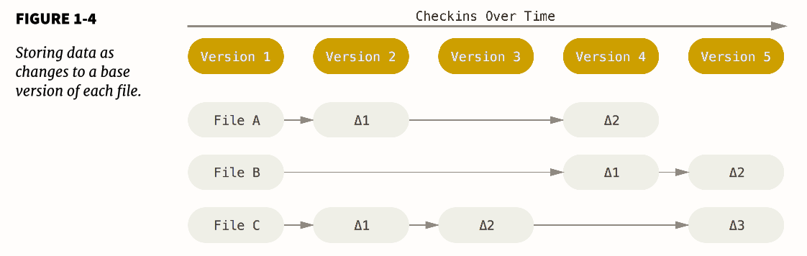
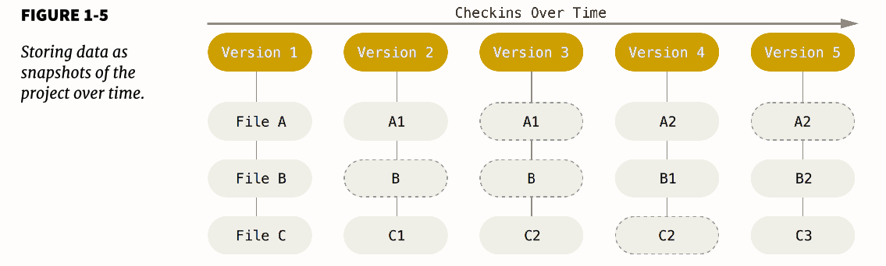
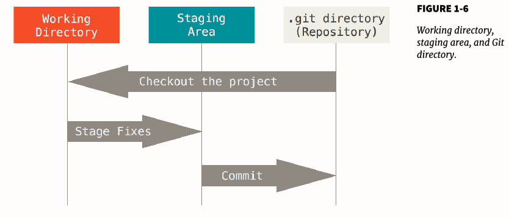
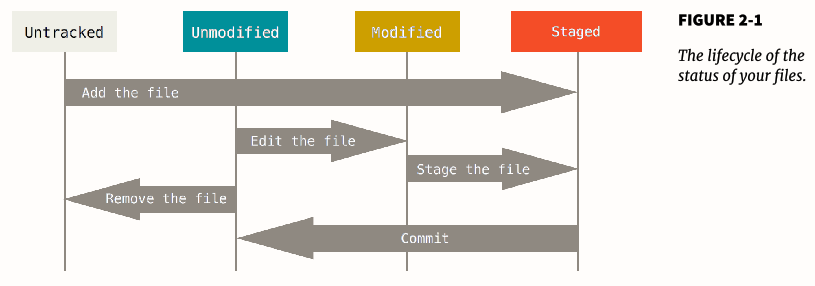

<!-- markdown-toc start - Don't edit this section. Run M-x markdown-toc-refresh-toc -->
**Table of Contents**

- [test](#test)
    - [test](#test-1)
        - [版本控制系统（vcs）发展](#版本控制系统vcs发展)
            - [git 发展](#git-发展)
        - [git basic](#git-basic)
            - [not difference but snapshot](#not-difference-but-snapshot)
            - [Nearly Every Operation Is Local](#nearly-every-operation-is-local)
            - [Git Has Integrity](#git-has-integrity)
            - [Git Generally Only Adds Data](#git-generally-only-adds-data)
            - [The Three States](#the-three-states)
            - [First-Time Git Setup](#first-time-git-setup)
        - [git basic](#git-basic-1)
        - [Git Branching](#git-branching)
        - [git in server](#git-in-server)
            - [四种协议](#四种协议)
        - [distribute git 工作流程](#distribute-git-工作流程)
            - [常见工作方式](#常见工作方式)
            - [提交更改](#提交更改)
            - [维护项目](#维护项目)
        - [github相关](#github相关)

<!-- markdown-toc end -->


# test
参考资料《Pro Git》

## test

### 版本控制系统（vcs）发展

- **local version control system**，典型命令为mac上至今还有的RCS工具
- **centralized version control system**，a single server contains all the versioned files, may cause single point of failure
- **distributed version control system**,  典型代表：git, Mercurial, Bazaar, Darcs. Client fully mirror the repository.

#### git 发展

2005年，linux kernel的社区团队与商业公司BitKeeper公司的合作结束后开发。

Some of the goals of the new system were as follows:

• Speed
• Simple design
• Strong  support  for  non-linear  development  (thousands  of  parallel
branches)
• Fully distributed
• Able to handle large projects like the Linux kernel eff iciently  (speed and
data size)


### git basic

git在设计时与其它的DVCS有较多的不同，即便提供了相同的API。As with many great things in life, Git began with a bit of creative destruction and fiery controversy. 

#### not difference but snapshot

**The major diff erence  between Git and any other VCS (Subversion and friends included) is the way Git thinks about its data.**  most other systems
store information as a list of file-based changes. These systems (CVS, Subver-
sion, Perforce, Bazaar, and so on) think of the information they keep as a set of
files and the changes made to each file over time. 

Git thinks about its data more like a stream of snapshots. It basically takes a picture of what all your files look like at that moment and stores a reference to that snapshot.

**This  is  an  important  distinction  between  Git  and  nearly  all  other  VCSs.** 

其它VCS存储的只是文件的变化，而Git存储的是整个文件的快照，如在Git branching里会有很大作用。

other VCSs :



Git:



#### Nearly Every Operation Is Local

不受服务器网速限制，可以脱机工作

#### Git Has Integrity

Everything in Git is check-summed before it is stored and is then referred to by
that checksum. 因此所有的文件变动git都能发现，并且能够避免传输等过程的信息丢失问题。  git使用SHA-1 hash，git基于hash value存储而非文件名。

#### Git Generally Only Adds Data

任何操作都是向git database中添加数据。因此任何操作都不会丢失之前的数据。

#### The Three States

Git has three main states: commited, modified, and staged.

- Committed  means that the data is safely stored in your local database. 
- Modified means that you have changed the file but have not committed it to your database yet. 
- Staged means  that  you  have  marked  a  modified  file  in  its  current  version  to  go into your next commit snapshot.

This leads us to the three main sections of a Git project: the Git directory, the
working directory, and the staging area.



- The Git directory is where Git stores the metadata and object database for your  project.  This  is  the  most  important  part  of  Git,  and  it  is  what  is  copied when you clone a repository from another computer.
- The  working  directory  is  a  single  checkout  of  one  version  of  the  project. These files are pulled out of the compressed database in the Git directory and placed on disk for you to use or modify.
- The  staging  area  is  a  file,  generally  contained  in  your  Git  directory,  that stores information about what will go into your next commit. It’s sometimes referred to as the “index”, but it’s also common to refer to it as the staging area.

The basic Git workflow goes something like this:

1. You modify files in your working directory.
2. You stage the files, adding snapshots of them to your staging area.
3. You do a commit, which takes the files as they are in the staging area and stores that snapshot permanently to your Git directory.

#### First-Time Git Setup

Git 配置文件目录

linux ------  These variables can be stored in three different places:

1. /etc/gitconfig file: Contains values for every user on the system and
  all their repositories. If you pass the option --system to git config, it
  reads and writes from this file specifically.
2. ~/.gitconfig  or  ~/.config/git/config  file:  Specific  to  your  user.
  You can make Git read and write to this file specifically by passing the --
  global option.
3. config file in the Git directory (that is, .git/config) of whatever repos-
  itory you’re currently using: Specific to that single repository.
  Each level overrides values in the previous level, so values in .git/config
  trump those in /etc/gitconfig.

Windows systems -----   Git looks for the .gitconfig file in the $HOME directory (C:\Users\$USER for most people). It also still looks for /etc/gitconfig, although it’s relative to the MSys root, which is wherever you decide to install Git on your Windows system when you run the installer.


The first thing you should do when you install Git is to set your user name and
e-mail address.

```bash
$ git config --global user.name "John Doe"
$ git config --global user.email johndoe@example.com
```

设置默认的编辑器（一般为vim）

` $ git config --global core.editor emacs`

checking your settings

```bash
$ git config --list
user.name=John Doe
user.email=johndoe@example.com
color.status=auto
color.branch=auto
color.interactive=auto
color.diff=auto
...
```

### git basic


**新建Git repository并添加文件**

``` bash
$ git init
$ git add *.c
$ git add LICENSE
$ git commit -m 'initial project version'
```

**cloning an existing repository to a local file directory**

` $ git clone https://github.com/libgit2/libgit2 mylibgit` 

**checking the status of your files**

` git status `



文件如果未加入git仓库会显示untracked file

` $ git status -s `   能够得到一个更为简短的状态。New  files  that  aren’t  tracked  have  a  ??  next  to  them,  new  files  that  have been added to the staging area have an A, modified files have an M and so on.

**Staging Modified Files**

对于修改的文件会显示为modified，将modified文件加入staged状态同样使用git add命令。git  add  is  a  multipurpose  command  –  you  use  it  to  begin
tracking  new  files,  to  stage  files,  and  to  do  other  things  like  marking  merge conflicted files as resolved. **It may be helpful to think of it more as “add this content to the next commit” rather than “add this file to the project”.**

` $ git add LICENSE ` 能够将modified状态下的LICENSE文件放入staged状态下，用于下一步的commit，此时如果再修改LICENSE文件，运行git status命令会发现modified 和 staged两种状态下都有LINCENSE文件，其中一个为修改前一个为修改后。


**Ignoring Files**

在代码目录下新建文件.gitignore添加以下内容：

``` bash
$ cat .gitignore
*.[oa]
*~

# ignore files begin with "~"
~*

# do track by "!"
!aa.txt

# ignore all files in the build/ directory
build/

# ignore doc/notes.txt, but not doc/server/arch.txt
doc/*.txt

# ignore all .txt files in the doc/ directory
doc/**/*.txt

```

在调用git add *命令后，以 .o or .a or ~ 的文件都不会被添加到git仓库中。


**Git diff 文档中具体改变**

调用 git status 时，显示的是哪些文件的改变。git diff 能够得到文件中具体内容的改变。


**Committing your change**

git commit 提交staged状态下的所有文件。可以使用-m参数添加备注。

`git commit -m "first commit" `


**Skipping the staging area**

可以跳过git add命令添加文件到staged状态，而直接提交所有文件。

`git comit -a -m "skip staging area" `


**Remove file**

git rm  将非staged状态下的文件移除，当文件已经改变时，需要加入-f选项强制移除

git rm --cached *.txt  将staged状态下的文件移除


**Moving files**

` git mv file_from file_to`  用于rename and move


**View the Commit History**

git log

-p show the difference introduction, -2 limit to only the last two entries

--stat  添加更加详细的状态

$ git log --pretty=format:"%h - %an, %ar : %s"  格式化输出

--graph 标注成简单的图

--since=2.weeks 限定时间


**Undoing Things**

when you commit too early and possibly forget to add some files, or you mess up your commit message.

git commit --amend

通常做法如下：

``` bash
$ git commit -m 'initial commit'
$ git add forgotten_file
$ git commit --amend
```


**Unmodifying a Modified file**

danger!  会删除文件的改变，将文件恢复到改变前的状态

` $ git checkout -- CONTRIBUTING.md `


**Remote**

```
$ git fetch [remote-name]

$ git push origin master 


$ git remote
$ git remote add pb https://github.com/paulboone/ticgit
$ git remote -v
$ git remote show origin
```

**Tagging**

git tage 列举素有的tag

git tag -l 'v1.8.5*'  限制tag范围

git tag -a v1.4 -m 'my version 1.4'  添加Annotated tag

git tag v1.4-lw    添加lightWeight tag，不支持-a、-m、-s等操作

git show v1.4

git tag -a v1.2 9fceb02  向某个commit添加操作， specify the commit checksum (or part of it)


git push origin v1.5   push指定的tag

git push origin --tags    push所有的tags


### Git Branching

Some people refer to Git’s branching model as its “killer feature,” and it certainly sets Git apart in the VCS community.

The way Git branches is incredibly lightweight, making branching operations nearly instantaneous, and switching back and forth between branches generally just as fast. Unlike  many  other  VCSs,  Git  encourages  workflows  that  branch  and  merge often, even multiple times in a day.


### git in server

#### 四种协议

1. 本地协议（使用本地目录或者NFS，适用于本地和网络共享目录操作，速度相对较慢，git内部文件访问没有控制）
2. HTTP。git 1.6.6之后的版本添加了smart http协议，使用git://开头，**最流行**。可以直接使用用户名+密码登录，不需要ssh协议的密钥，速度快。
3. ssh协议。使用ssh:// or user@server: 开头。假设简单，无法匿名访问。
4. git协议。单独使用一个端口9418，速度最快，但没有用户授权。一般会同时提供ssh或https协议。


### distribute git 工作流程

#### 常见工作方式

1. 集中式工作

所有开发人员将开发项目提交到同一仓库。*如果两个开发者从中心仓库克隆代码下来，同时作了一些修改，那么只有第一个开发者可以顺利地把数据推送回共享服务器。 第二个开发者在推送修改之前，必须先将第一个人的工作合并进来，这样才不会覆盖第一个人的修改。*


2. 集成管理者工作流

允许多个远程仓库存在。每个开发者拥有自己仓库的写权限和其他所有人仓库的读权限。需要做贡献的开发者首先clone出自己的仓库，然后推送修改，由官方仓库维护者拉取合并。

> 
1. 项目维护者推送到主仓库。
2. 贡献者克隆此仓库，做出修改。
3. 贡献者将数据推送到自己的公开仓库。
4. 贡献者给维护者发送邮件，请求拉取自己的更新。
5. 维护者在自己本地的仓库中，将贡献者的仓库加为远程仓库并合并修改。
6. 维护者将合并后的修改推送到主仓库。

3. 司令官与副官工作流

主要用于超大型项目（linux内核），能够将开发分为三级，司令官、副官、普通开发者。

#### 提交更改

在小型团队中，只需要创建新的分支然后并入主分支（合并时要更新本地仓库(fetch))

派生的公开项目没有直接的项目写权限，因此方式不同。fork项目后添加新的特征分支，pull-request通知项目作者拉取项目分支。某些情况需要rebase后提交，略麻烦。

通过邮件发送补丁。

#### 维护项目

创建新的分支进行测试。

对于需要长期合作的开发者，添加远程分支较为容易：

```
$ git remote add jessica git://github.com/jessica/myproject.git
$ git fetch jessica
$ git checkout -b rubyclient jessica/ruby-client
```

对于少量的修改，可以直接通过邮件发送修改补丁。

对比提交代码。直接使用diff会将当前master分支与特征分支进行对比，而使用`$ git diff master...contrib`能够将其与公共祖先对比。

打标签、生成构建号、准备一次发布、制作提交简报。

### github相关


